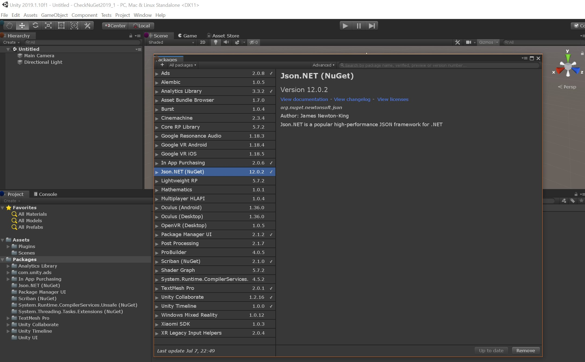

# UnityNuGet [](https://github.com/xoofx/UnityNuGet/actions) [](https://unitynuget-registry.azurewebsites.net/status) [](https://unitynuget-registry.azurewebsites.net/-/all)


This project provides a seamlessly integration of a [curated list](registry.json) of NuGet packages within the Unity Package Manager.

> DISCLAIMER: This is not an official service provided by Unity Technologies Inc.

## Installation

### Add scope registry (manifest.json):

In order to use this service you simply need to edit the `Packages/manifest.json` in your project and add the following scoped registry:

```json
{
  "scopedRegistries": [
    {
      "name": "Unity NuGet",
      "url": "https://unitynuget-registry.azurewebsites.net",
      "scopes": [
        "org.nuget"
      ]
    }
  ],
  "dependencies": {
     "org.nuget.scriban":  "2.1.0"
  }
}
```

### Add scope registry (Package Manager UI):

Instructions: https://docs.unity3d.com/Manual/class-PackageManager.html

```
Name: Unity NuGet

Url: https://unitynuget-registry.azurewebsites.net

Scope(s): org.nuget
```

### Disable Assembly Version Validation

This step is necessary to ensure that binding redirects for [strongly named assemblies](https://learn.microsoft.com/en-us/dotnet/standard/assembly/strong-named) in NuGet packages resolve correctly to paths _within the Unity project_. 

- In Unity 2022.2+, this is the [default behavior](https://forum.unity.com/threads/editor-assembly-loading-issues-unloading-broken-assembly-could-not-load-signature.754508/#post-8647791), so no action is required.
- For earlier Unity versions, uncheck "Project Settings > Player > Other Settings > Configuration > Assembly Version Validation"

### Verify installation

> WARNING: If you are encountering weird compilation errors with UnityNuGet and you have been using UnityNuGet already, 
> it could be that we have updated packages on the server, and in that case, you need to clear the cache containing
> all Unity NPM packages downdloaded from the `unitynuget-registry.azurewebsites.net` registry.
> On Windows, this cache is located at: `%localappdata%\Unity\cache\npm\unitynuget-registry.azurewebsites.net`
>
> Cache locations by OS: https://docs.unity3d.com/Manual/upm-cache.html

When opening the Package Manager Window, you should see a few packages coming from NuGet (with the postfix text ` (NuGet)`)



## Adding a package to the registry

This service provides only a [curated list](registry.json) of NuGet packages

Your NuGet package needs to respect a few constraints in order to be listed in the curated list:

- It must have non-preview versions (e.g `1.0.0` but not `1.0.0-preview.1`)
- It must provide `.NETStandard2.0` assemblies as part of its package

You can send a PR to this repository to modify the [registry.json](registry.json) file (don't forget to maintain the alphabetical order)

You also need to **specify the lowest version of your package that has support for `.NETStandard2.0`** upward so that other packages depending on your package have a chance to work with.

Beware that **all transitive dependencies of the package** must be **explicitly listed** in the registry as well.

> NOTE: 
> * We reserve the right to decline a package to be available through this service
> * The server will be updated only when a new version tag is pushed on the main branch.

## Compatibility

Only compatible with **`Unity 2019.1`** and potentially with newer version.

> NOTE: This service is currently only tested with **`Unity 2019.x, 2020.x and 2021.x`**
>
> It may not work with a more recent version of Unity

## Docker

> Available in [ghcr (GitHub Container Registry)](https://github.com/xoofx/UnityNuGet/pkgs/container/unitynuget).
> 
> Supported platforms:
> - linux/amd64
> - linux/arm64

Example of a basic docker-compose.yml file:

```yaml
services:
  unitynuget:
    image: ghcr.io/xoofx/unitynuget:latest
    ports:
      - 5000:80
    volumes:
      - ./unity_packages:/app/unity_packages
      - ./registry.json:/app/registry.json # (Optional) You can have your own registry.json with a different package list than the one already included in the repository
```

There is a complete example with all available options in [examples/docker](examples/docker).

### Accessing a private NuGet feed from Azure DevOps

As documented in the example, it is possible to provide a custom NuGet.Config file.

To add a private feed, the following fields must be filled in.

```xml
<?xml version="1.0" encoding="utf-8"?>
<configuration>
  <packageSources>
    <clear />
    <add key="nuget.org" value="https://api.nuget.org/v3/index.json" protocolVersion="3" />
    <add key="MyCustomFeed" value="https://pkgs.dev.azure.com/<ORG_NAME>/<PROJECT_NAME>/_packaging/<FEED_NAME>/nuget/v3/index.json" />
  </packageSources>
  <packageSourceCredentials>
    <MyCustomFeed>
      <add key="Username" value="<Azure DevOps Email>" />
      <add key="ClearTextPassword" value="<Azure DevOps PAT>" />
    </MyCustomFeed>
  </packageSourceCredentials>
</configuration>
```

> **Note**: [The Azure DevOps PAT](https://learn.microsoft.com/en-us/azure/devops/organizations/accounts/use-personal-access-tokens-to-authenticate) must have Packaging (Read) permissions.

## FAQ

### **Where is hosted this service?**

On Azure through my own Azure credits coming from my MVP subscription, enjoy!

### **Why can't you add all NuGet packages?**

The reason is that many NuGet packages are not compatible with Unity, or do not provide `.NETStandard2.0` assemblies or are not relevant for being used within Unity.

Also currently the Package Manager doesn't provide a way to filter easily packages, so the UI is currently not adequate to list lots of packages.

### **Why does it require .NETStandard2.0?**

Since 2019.1.x, Unity is compatible with `.NETStandard2.0` and it is the .NET profile that is preferred to be used.

Having a `.NETStandard2.0` for NuGet packages for Unity can ensure that the experience to add a package to your project is consistent and well supported.

> More information: https://docs.unity3d.com/Manual/dotnetProfileSupport.html

### **How this service is working?**

This project implements a simplified compatible NPM server in C# using ASP.NET Core and converts NuGet packages to Unity packages before serving them. 

Every 10min, packages are updated from NuGet so that if a new version is published, from the curated list of NuGet packages, it will be available through this service.

Once converted, these packages are cached on the disk on the server.

## License

This software is released under the [BSD-Clause 2 license](https://opensource.org/licenses/BSD-2-Clause). 

## Author

Alexandre Mutel aka [xoofx](https://xoofx.github.io)
